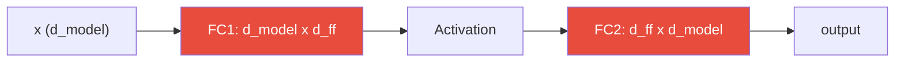
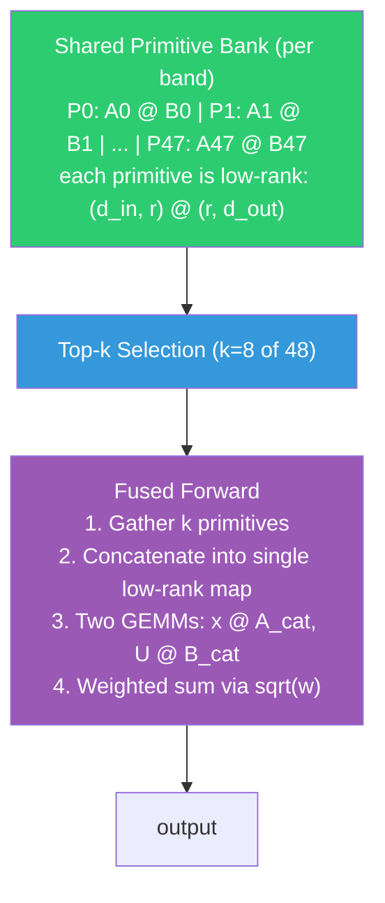
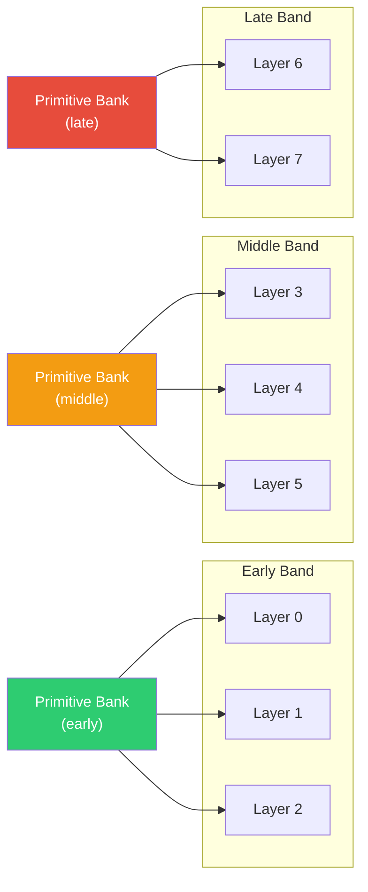
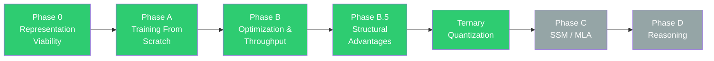

# PILON

**Primitive-Induced Linear Operator Network**

PILON replaces dense FFN weight matrices in transformers with shared low-rank primitives combined via learned per-layer composition weights. Instead of storing full `(d_model, d_ff)` matrices per layer, a small bank of low-rank primitives is shared across layers within a band, and each layer learns *which* primitives to combine and *how* to weight them.

The result: competitive language modeling quality at a fraction of the FFN parameter cost, with structural knobs (rank scheduling, progressive unfreezing, tiered VRAM loading, early exit) that dense FFNs simply cannot offer.

### The Simple Version

Think of a standard transformer like a library where every shelf holds a completely separate collection of books — if you need an answer, each layer searches its own entire collection from scratch, even though most shelves contain a lot of the same reference material.

PILON takes a different approach. Instead of giving every shelf its own full collection, we build a single shared reference section of small, reusable building blocks ("primitives"). Each shelf only needs a short recipe card that says *"grab these 8 blocks and combine them like this."* The building blocks are tiny (low-rank), the recipe cards are cheap, and most of the knowledge is shared — so you get nearly the same answers while doing roughly **half the math** and storing far fewer total books.

On top of that, PILON can constrain its building blocks to just three values ($-1$, $0$, $+1$) — the equivalent of writing the reference material in shorthand. This **ternary quantization** makes the model even more compact with minimal quality loss.

---

## How It Works

### Dense FFN (standard transformer)



> Two full dense matrices per layer — millions of parameters each, no sharing.

### PILON Compositional FFN



Layers within a **band** (e.g., layers 0-2 = "early") share the same primitive bank but learn independent composition weights. This means early layers can share low-level feature extractors while late layers share task-specific transforms.

### Band Sharing Structure



### Ternary Quantization (BitNet b1.58)

Primitive weights can be constrained to $\{-1, 0, +1\}$ using absmean scaling with straight-through estimation (STE). Combined with 8-bit activation quantization and SubLN normalization, this produces extremely compact models with minimal quality loss.

$$w_{\text{ternary}} = \text{sign}\!\left(\text{round}\!\left(\frac{w}{\alpha}\right)\right) \cdot \alpha, \quad \alpha = \text{mean}(|w|)$$

---

## Architecture Overview

| Component | Description |
|-----------|-------------|
| **PrimitiveBank** | Stores `n` low-rank primitives as packed `A (n, d_in, rank)` and `B (n, rank, d_out)` tensors with learned latent scale/bias |
| **BandPrimitiveBanks** | Groups layers into bands that share primitive banks (separate fc1/fc2 banks) |
| **LayerCompositionWeights** | Per-layer learned logits over primitives, softmax-normalized, top-k selected |
| **CompositionalFFN** | Fused forward path: top-k select, concatenate, 2 GEMMs, weighted sum |
| **MoECompositionalFFN** | Token-dependent routing: each token picks different expert compositions |
| **TieredPrimitiveBank** | VRAM-efficient: only `n_hot` primitives in GPU memory, rest in CPU pinned memory |
| **ExitGate** | Per-layer gate that skips FFN computation for "easy" tokens during inference |

---

## Model Configurations

<table>
<tr><th></th><th>48M (Dev / Ablation)</th><th>360M (Scale Validation)</th></tr>
<tr><td><b>d_model</b></td><td>512</td><td>1024</td></tr>
<tr><td><b>n_layers</b></td><td>8</td><td>24</td></tr>
<tr><td><b>n_heads</b></td><td>8</td><td>16</td></tr>
<tr><td><b>d_ff</b></td><td>2048</td><td>4096</td></tr>
<tr><td><b>n_primitives</b></td><td>48</td><td>80</td></tr>
<tr><td><b>rank</b></td><td>48</td><td>80</td></tr>
<tr><td><b>top_k</b></td><td>8</td><td>8</td></tr>
<tr><td><b>bands</b></td><td>early(0-2), middle(3-5), late(6-7)</td><td>early(0-7), middle(8-15), late(16-23)</td></tr>
<tr><td><b>max_seq_len</b></td><td>512</td><td>2048</td></tr>
</table>

---

## Results

### Training Quality (48M, 500M tokens, FineWeb-Edu)

All runs trained to 15,255 steps on identical data with batch=8, grad_accum=8, seq_len=512.

| Model | Final Val Loss | Val PPL | vs Dense |
|-------|:-------------:|:-------:|:--------:|
| Dense-48M | 4.1654 | 64.42 | 1.00x |
| PILON-48M Ternary + SubLN + SqReLU | 4.5958 | 99.07 | **1.10x** |
| PILON-48M Ternary + SubLN | 4.6473 | 104.30 | 1.12x |
| PILON-48M fp16 | 4.6896 | 108.81 | 1.13x |

- Training is fully stable across all configs: no NaN, no divergence, no primitive collapse
- Primitive entropy stays healthy throughout (~2.5+ at end of all runs)
- Ternary + SqReLU is the best PILON variant, outperforming even fp16 PILON (99 vs 109 PPL)
- The gap is convergence speed, not a ceiling — loss continues improving with more tokens

### Throughput (RTX 4070, batch=8, seq=512, fwd+bwd)

| Config | Eager (ms) | Compiled (ms) | tok/s (compiled) |
|--------|:---------:|:-------------:|:----------------:|
| Dense-48M | 54 | 49 | ~84k |
| PILON-48M-Ternary | 101 | **54** | ~76k |
| **Ratio** | 1.88x | **1.10x** | --- |

> [!TIP]
> `torch.compile` fuses PILON's many small elementwise kernels (ternary quantization, RMSNorm, sqrt scaling, etc.) into a handful of Triton kernels, closing the throughput gap almost entirely. Without compile, PILON suffers from ~560 tiny CUDA kernel launches per iteration vs ~32 for dense. Always use `--compile`.

### Compute Math (Why PILON Should Be Efficient)

Per token, per layer at 48M config:

| | Multiplies | % of Dense |
|---|:---------:|:----------:|
| Dense FFN | ~2.1M | 100% |
| PILON FFN (top-8 of 48, rank 48) | ~1.0M | **48%** |

PILON does roughly half the FLOPs of a dense FFN. The compiled profiler confirms this: PILON matmul time (67ms) < Dense matmul time (72ms) across identical workloads.

---

## Quickstart

<details>
<summary><b>Windows Setup</b></summary>

```powershell
python -m venv .venv
.\.venv\Scripts\Activate.ps1
pip install -r requirements.txt
# For torch.compile support (highly recommended):
pip install triton-windows
```

</details>

<details>
<summary><b>Linux Setup</b></summary>

```bash
python -m venv .venv
source .venv/bin/activate
pip install -r requirements.txt
```

</details>

### Smoke Test

```bash
python -m pilon_r.train --smoke-test --device cuda
```

### Train 48M Ternary PILON

```bash
python -m pilon_r.train \
    --model-size 48m \
    --ffn-type compositional \
    --phase1-sparse \
    --phase1-top-k 8 \
    --ternary \
    --use-subln \
    --use-squared-relu \
    --compile \
    --freeze-primitives-phase2 \
    --topk-cache-steps 10 \
    --comp-lr-mult 2.0 \
    --forward-fast-mode on \
    --forward-fast-min-topk 1 \
    --band-diversity-weight 0.01 \
    --no-checkpoint-ffn \
    --total-tokens 500000000 \
    --batch-size 8 \
    --grad-accum 8 \
    --seq-len 512 \
    --dataset HuggingFaceFW/fineweb-edu \
    --output-dir outputs/48m_ternary \
    --log-comp-stats
```

Or use the provided scripts:

```bash
bash scripts/run_48m_ternary_crossover.sh   # 48M, 500M tokens
bash scripts/run_360m_ternary_crossover.sh  # 360M, 1B tokens, torch.compile
```

### Profile Throughput

```bash
python scripts/profile_pilon.py
```

### Evaluate / Generate

```bash
python -m pilon_r.evaluate outputs/48m_ternary/final_model.pt --device cuda
```

### SFT Fine-tuning

```bash
python -m pilon_r.sft outputs/48m_ternary/final_model.pt \
    --epochs 1 --output-dir outputs/48m_ternary_sft --device cuda
```

---

## Key Training Features

- **Two-phase training**: Phase 1 trains primitives with all active (no top-k), Phase 2 freezes primitives and trains composition weights with top-k sparsity
- **Separate parameter groups**: Primitives get higher LR (2x) + weight decay; compositions get lower LR (0.5x) + zero weight decay
- **Rank scheduling**: Start with low effective rank, increase to full rank during warmup
- **Progressive band unfreezing**: Early band trains first, then middle, then late
- **Ternary weight caching**: Pre-quantize all primitives once per optimizer step, reuse via index_select across gradient accumulation micro-batches
- **`torch.compile`**: ~1.9x speedup on PILON by fusing elementwise ops into Triton kernels

---

## Key CLI Flags

| Flag | Description |
|------|-------------|
| `--model-size {48m,360m,500m}` | Model scale |
| `--ffn-type {compositional,standard}` | PILON vs dense baseline |
| `--ternary` | Enable ternary weight quantization |
| `--use-subln` | SubLN normalization (ternary stability) |
| `--use-squared-relu` | Squared ReLU activation |
| `--compile` | Enable torch.compile |
| `--phase1-sparse` | Use top-k in phase 1 (skip dense warmup) |
| `--freeze-primitives-phase2` | Freeze primitive banks in phase 2 |
| `--checkpoint-ffn` / `--no-checkpoint-ffn` | Gradient checkpointing for FFN (VRAM vs speed) |
| `--log-comp-stats` | Log composition weight statistics |

---

## Project Structure

<details>
<summary><b>Full file tree</b></summary>

```
pilon_r/
  train.py                     Training loop
  evaluate.py                  Evaluation + generation
  sft.py                       Supervised fine-tuning
  benchmark.py                 Inference benchmarking
  benchmark_efficiency.py      VRAM / compute / quality benchmarks

pilon_r/core/
  model.py                     PILONTransformer
  primitives.py                PrimitiveBank, ternary quantization, RMSNorm
  ffn.py                       CompositionalFFN, MoECompositionalFFN
  tiered_bank.py               TieredPrimitiveBank (hot/warm VRAM tiering)
  early_exit.py                ExitGate + gate training
  config.py                    All configuration dataclasses
  data.py                      Streaming data loading
  metrics.py                   Metric utilities

pilon_r/configs/
  model_360m.py                360M model configurations
  model_500m.py                500M model configurations

scripts/
  run_48m_ternary_crossover.sh   48M ternary experiment
  run_360m_ternary_crossover.sh  360M ternary experiment
  run_48m_crossover.sh           48M fp16 crossover
  run_360m_crossover.sh          360M fp16 crossover
  profile_pilon.py               Throughput profiler

docs/
  PROGRESS.md                  Detailed research progress log
  PHASE_PLAN_v2.1.md           Development plan
  commands.md                  Common commands reference
```

</details>

## Outputs

Training runs write to `outputs/` by default. Each run saves:
- `final_model.pt` — Final checkpoint
- `metrics.jsonl` — Per-step training metrics
- `config.json` — Full model + training configuration
- Periodic checkpoints at configurable intervals

---

## Research Status



| Phase | Status | Outcome |
|-------|:------:|---------|
| Phase 0: Representation Viability | :white_check_mark: | Low-rank primitives can represent FFN structure |
| Phase A: Training From Scratch | :white_check_mark: | Stable training, learns language, no collapse |
| Phase B: Optimization & Throughput | :white_check_mark: | ~87k tok/s compiled, 1.13x convergence gap |
| Phase B.5: Structural Advantages | :white_check_mark: | Tiered banks, early exit, sparse compute path |
| Ternary Quantization (BitNet b1.58) | :white_check_mark: | {-1,0,1} weights, 1.10x compiled throughput ratio |
| Phase C: SSM/MLA Integration | :hourglass: | Long context, memory efficiency |
| Phase D: Reasoning Integration | :hourglass: | R1-style inference-time reasoning |

---

## AI Disclosure

This project was developed with assistance from AI tools, including [Claude Code](https://claude.ai) (Anthropic) and [Codex](https://openai.com/codex) (OpenAI). AI was used to help with implementation, debugging, profiling, and research iteration. All architectural decisions, experiment design, and result interpretation were human-directed.

---

## License

MIT License (see [`LICENSE`](LICENSE)).
